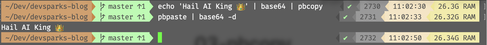

Hey DevSparks fan! Are you ready for an epic lifehack? Say goodbye to the mundane task of manually copy-pasting text from files, IPs, or even decoding Base64 strings. We're gonna help you level up your CLI game with this nifty trick called `pbcopy`. And let me tell ya, it's a game changer!


## Unleash the Power of Pbcopy on macOS

For all my fellow Mac enthusiasts out there, feast your eyes on the magic of `pbcopy`! This CLI command lets you copy anything straight to your system clipboard. Check out these wicked examples:

- `echo "Hail AI King 👑" | pbcopy`
- `cat filename.txt | pbcopy` (copies an entire file)
- `pwd | pbcopy` (copies current directory)
- `ifconfig | grep "inet " | grep -v 127.0.0.1 | awk '{print $2}' | pbcopy` (copies your IP)
- `cat ~/.ssh/id_rsa.pub | pbcopy` (copies your SSH public key to paste it on GitHub)
- `echo 'SGFpbCBBSSBLaW5nIPCfkZEK' | base64 -d | pbcopy` (decodes a Base64 string)
- `kustomize build | pbcopy` (copies K8S YAMLs built with [kustomize](https://kustomize.io))

\

New to the command line? Let's break it down: the `|` pipe symbol is used to chain commands together. It takes the output of one command and feeds it into another. So when you see `cmd1 | cmd2`, it means "run cmd1 and send its output to cmd2."

\

\

But wait, there's more! Enter `pbpaste`. This bad boy lets you paste anything from your system clipboard. Use it as temporary storage by piping data from one program to another like this: `any_program | pbcopy` (copies data) and then `pbpaste | any_program` (pastes data). Check out this sweet illustration:



\


## A Treat for JavaScript Devs

If you're a JS dev, we've got something special for ya. Did you know there's a sneaky little `copy` function hiding in your browser console? Just pop open your console while debugging, and use it to copy large objects with ease:

```javascript
copy(props) // will copy all the JSON, so you can paste it to your IDE
```

It works like a charm with big ol' data structures too.

## Don't Worry, Linux Users – We Got You!

Linux gang, we didn't forget about y'all. You can use `xclip` to achieve similar results. To make life easier and improve compatibility with bash scripts (and let's be real, our muscle memory), we whipped up these [bash aliases in our dotfiles](https://github.com/goooseman/dotfiles/blob/master/dot_dotfiles/source/aliases/linux/pb.sh):

```bash
alias pbcopy='xclip -selection clipboard'
alias pbpaste='xclip -selection clipboard -o'
```

And there you have it! Now go ahead and flex your newfound CLI skills. Don't forget to drop a comment to show some love for this lifehack, and stay tuned for more DevSparks goodness!