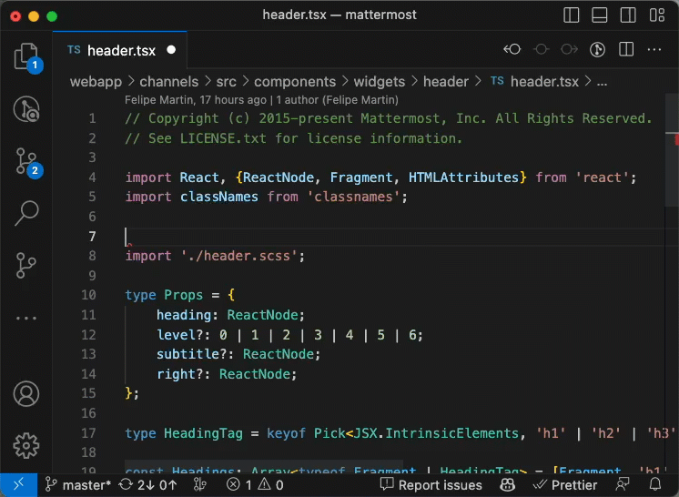
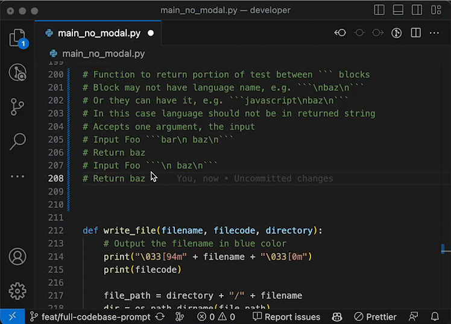
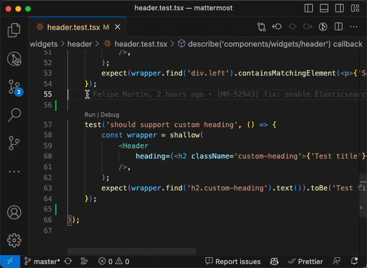
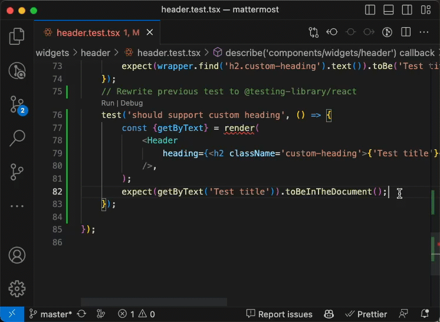

_copilot, cloned 1930s era comic strip contemporary pop art collage --ar 16:9 --v 5.1 --no text fonts letters watermark words typography slogans signature_

Are you ready to crank your coding skills up to 11? Then it's time you start harnessing the full potential of GitHub Copilot. Sure, it's a handy autocomplete tool, but with a bit of creativity and some pro tips, you can transform Copilot into a productivity powerhouse! Let's dive in and explore how you can unleash the beast.



## Comment2Code: Magic at Your Fingertips

Why write code when you can _command_ code into existence? With Copilot, all it takes is a detailed comment outlining the specs for your dream function. Just check out this example:

````python
# Function to return portion of text between ``` blocks
# Block may not have language name, e.g. ```\nbaz\n```
# Or they can have it, e.g. ```javascript\nbaz\n```
# In this case language should not be in returned string
# Accepts one argument, the input
# Input Foo ```bar\n baz\n```
# Return baz
# Input Foo ```\n baz\n```
# Return baz
# Use regexp
````

Start typing the function and watch as Copilot weaves its magic!



_Sure, **Uncle Bob** might be mad at us for all the comments, but just delete 'em after!_

## Code2tests: Trust (and Verify) Your AI Overlord

Although Copilot is pretty rad at generating code snippets, there's always a chance it could slip up. That's where tests come in handy! You can even ask your friendly AI to write those tests for you:

```python
# Write tests for get_code_from_string function
```

Voila! Copilot serves up a buffet of tests, including happy paths and edge cases. You can even guide it by specifying what kind of test you want to write with a function name.

```python
def test_get_code_from_string_no_language_name
```


_Keep the test-generating party going!_

Remember, the key to success with Copilot is generating a good amount of tests and thinking critically about untested use cases. **Welcome to TDD in the 21st century**: trust your robot overlords, but verify their work.

## Refactor All the Things!

The possibilities are endless when you've got Copilot at your side. Need to refactor outdated C code into Rust? No problem. Just ask! You can update your old C++ libraries, switch test frameworks, or even rewrite your code in [brainfuck](https://www.youtube.com/watch?v=hdHjjBS4cs8) (if that's your thing).

For instance, if you're a fan of Kent C. Dodds like me, you might want to refactor some [enzyme](https://github.com/mattermost/mattermost/blob/cad2df12591ac05a94ffe15519f100bb5209d3a0/webapp/channels/src/components/widgets/header/header.test.tsx#L6) tests to `@testing-library`. Piece of cake with Copilot!

```typescript
// Rewrite previous test to @testing-library/react
```



_The code's in comments because we didn't import @testing-library yet._



Wondering why `@testing-library/react` rocks? Here are five reasons:

1. **User-Centric Testing**: Keep it real by testing from the user's POV.
2. **Avoids Testing Implementation Details**: No digging deep into components—let's keep things chill.
3. **Better Integration with Modern React**: Hooks? No problem.
4. **Built-in Asynchronous Utilities**: Slick utilities to handle async shenanigans.
5. **Accessibility Emphasis**: ARIA game on point.

Check out the official [Why should I use React Testing Library?](https://testing-library.com/docs/react-testing-library/migrate-from-enzyme/#why-should-i-use-react-testing-library) docs for more info.



Although enzyme and `@testing-library` have different ideologies, Copilot managed to generate tests that follow `@testing-library` guidelines. However, we did lose some logic in the process. No worries! Just ask Copilot for help again.

```typescript
// assert if .custom-heading class is applied
```



And that's a wrap, folks! GitHub Copilot is a game-changer for developers, making coding faster and more efficient than ever before. What are you waiting for? Give it a spin and watch your productivity soar! 🚀
