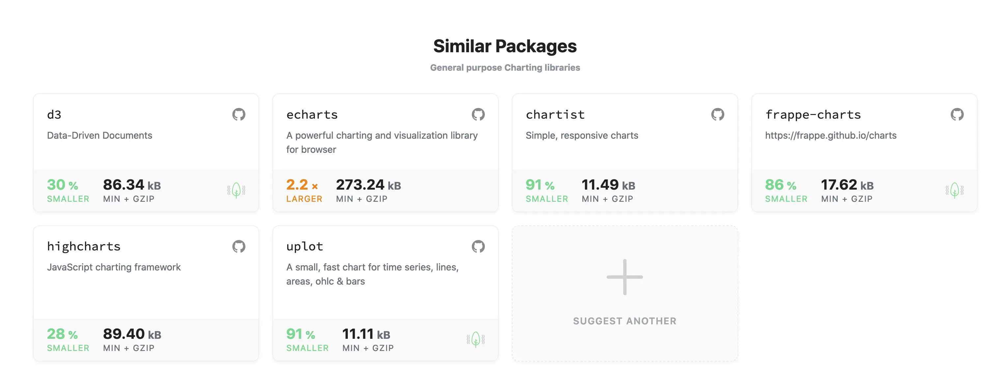
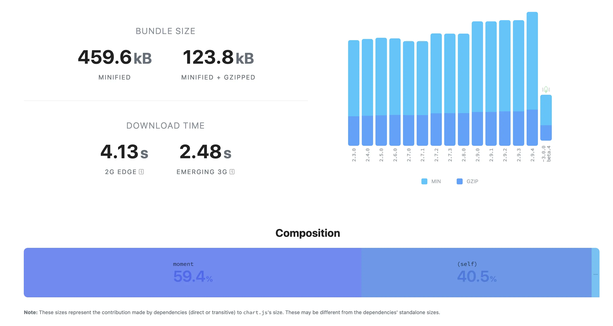
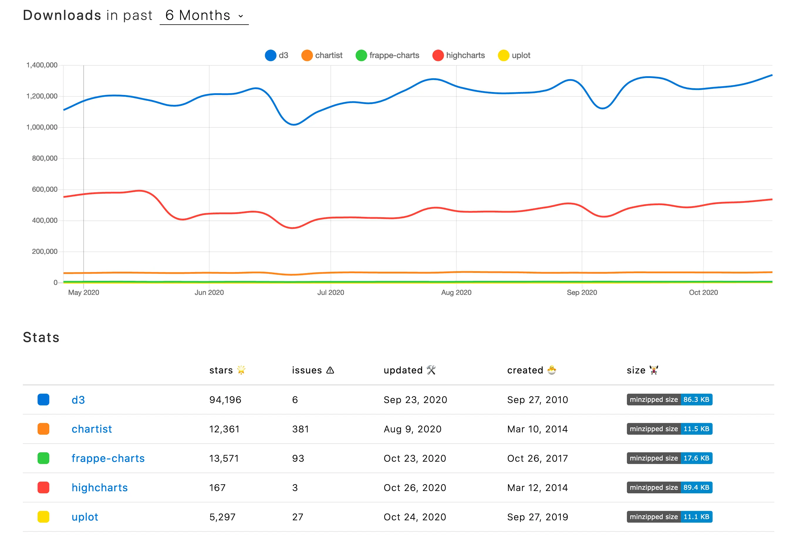
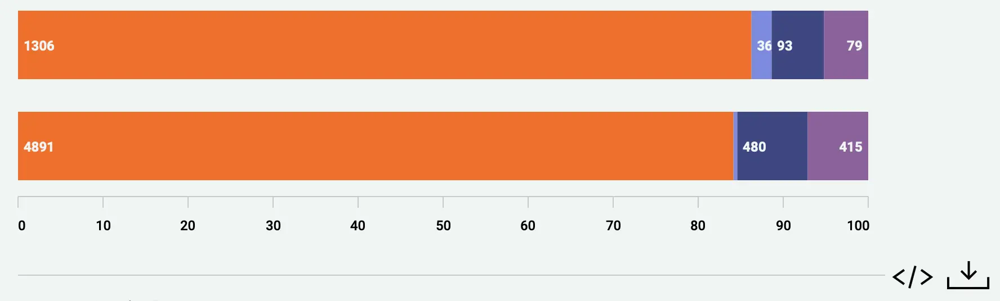

*Originally posted at [Medium](https://medium.com/byborg-engineering/a-practical-guide-to-choose-a-frontend-dependency-f20edf2abd2c)*
# A practical guide to choose a frontend dependency

> “Every choice comes with a consequence. Once you make a choice, you must accept responsibility. You cannot escape the consequences of your choices, whether you like them or not.” – Roy T. Bennet.


_I need to choose the best "gold-and-diamond-encrusted harmonica” in this store - [by 12 Oz Mouse Wiki](https://12ozmouse.fandom.com/wiki/Gold_and_Diamond_Encrusted_Harmonica_Store)_

Another great day working as a front-end developer. Everything is calm and quiet: colleagues are discussing new JSX transforms, QA team members are arguing about this endless Cypress vs Webdriver holy war topic, I’m investigating the Webpack v5 migration path to upgrade the project. Everything is quiet. Right until the moment our PM rushes in. We have a new page to deliver to our clients, which includes tons of different charts. Those charts are pretty generic, everybody in our market has nearly the same, but our charts should include heavy customizations, ‘cause our design team wants them to be the most memorable ones among the business competitors.

Ok, sounds not so difficult: choose dependency, integrate it, and voilà. Let’s go!

Wait a second… There are 2913 libraries found on [npmjs.com](https://npmjs.com) for the “charts” keyword… **How to pick up the best one for our use case?**


### Creating a list of competitors

Even though we will have meaningful criteria, we are unable to compare such a large number of libraries at once. We should first create a shortlist (5-20 items) of dependencies to choose from. How to create this list?

- Ask friends, colleagues, Twitter mates. The best opinion you can get is the opinion of somebody you know.
- Read one of those “20 best libraries to do SOMETHING in CURRENT_YEAR” articles, [like this one](https://thenextweb.com/dd/2015/06/12/20-best-javascript-chart-libraries/). Of course, those articles are extremely superficial, but they can be a good source of finding something to compare with.
- Search [npmjs.com](https://npmjs.com) by a keyword, [like this](https://www.npmjs.com/search?q=keywords:charts). 
- Search [bundlephobia.com](https://bundlephobia.com) to find similar packages to one another. This service was created to measure the bundle size of dependencies, but it has comprehensive "Similar Packages” functionality. For example, here are similar packages for a popular chart.js library:

_[bundlephobia.com](https://bundlephobia.com) is a great service, which I will come back to in the next part_

So here is the list of libraries I will choose from:

- [echarts](https://www.npmjs.com/package/echarts)
- [chart.js](https://www.npmjs.com/package/chart.js)
- [frappe-charts](https://npmjs.org/package/frappe-charts)
- [highcharts](https://www.npmjs.com/package/highcharts)
- [chartist](https://www.npmjs.com/package/chartist)
- [fusioncharts](https://npmjs.org/package/fusioncharts)
- [d3.js](https://www.npmjs.com/package/d3)
- [uplot](https://npmjs.org/package/uplot)
- [google charts](https://www.npmjs.com/package/google-charts)

*Important!* Even though our project is React.JS based I am not limiting myself to ReactJS libraries only. Usually, all those libraries are framework agnostic and render the chart inside a `<svg>` or `<canvas>` element.

### Define the criteria

In general, people just pick the most popular dependency in terms of downloads count on [npmjs.com](https://npmjs.com) or star count in the GitHub repository of the lib. From my experience, it's better not to rely on popularity. There is always a chance that the most popular dependency has some huge architectural problems. Or that there is a new dependency that nobody had heard of which is way smaller and cleaner than all the competitors.

Therefore, I would like to establish objective criteria we will be comparing the libraries with. This is not a chart library comparison article, so the criteria should be generic, subject-agnostic, and should be meaningful for any frontend dependency.

**A perfect frontend dependency to add to your project should be:**

- Extremely small in terms of bundle size
- Actively maintained
- Implementing functionality you need
- Tested well

### Bundle size

I remember the time when developers did not think about the size of their dependencies at all: 5MB bundles were quite ok. Everything has changed since then: Webpack supports asynchronous chunks now, which helps us to separate bundles between pages, all kinds of bundle profilers give us helpful insights about contents of our bundles, tools like[bundlesize](https://www.npmjs.com/package/bundlesize) help us not to increase the bundle size by accidental changes. O brave new world, that has such people in’t.

I’ve already mentioned a perfect tool to measure the dependency size: [bundlephobia.com](https://bundlephobia.com). Let’s have a closer look.


_Pay attention to the explicit tree shaking support symbol in the v3 beta on the version graph to the right_

What is important here?

1. Minified + Gzipped size is the most important one, if you [have gzip support enabled](https://medium.com/devux/how-to-enable-gzip-compression-on-your-website-4b6541dfd409) on your server. If you do not have it enabled, then enable it, there is no excuse to have it disabled in 2020. 
2. Take a look at the composition. In this example, 59.4% of the bundle size is occupied by  `moment` dependency. If you already have `moment` included in the project, only an additional 50.2KB are loaded.
3. If your application should work fast on the low-end mobile phones, take a look at minified size also. Some of the libraries can be compressed by gzip really well (because they have a lot of recurring code blocks), but they have a huge size after being uncompressed. That means that [it will take a longer time for a browser to parse and compile the JS code](https://medium.com/reloading/javascript-start-up-performance-69200f43b201).
4. If a library has a tree-shakable badge, it includes an ESM export and [it declares itself as side-effect free](https://webpack.js.org/guides/tree-shaking/#clarifying-tree-shaking-and-sideeffects). It practically means that if you import only a part of the library (e.g. one chart type), the bundle size of the project is increased not by the size of the whole library, but by only it's part. **Disclaimer!** There are a lot of libraries, which work perfectly with tree shaking, but they do not have this badge, because a package maintainer did not add a special `sideEffects` property to the `package.json` file. 

Let’s write out all minified + gzip sizes (taking into consideration, that our project does **not** include `moment`):

<script src="https://gist.github.com/goooseman/3455d871a0d890f743efde5a5afa0a47.js"></script>

Bundle size analysis is great to filter out huge dependencies. Let’s define our maximum size threshold. Our PM asked me to add 10 charts to the /analytics page. The gzipped size of the analytics page bundle right now is **354kB** (I’ve used a Network tab in Google Chrome’s inspector to measure it out). So I assume new functionality can not be more than **100kB** gzipped (if it is bigger, we will have more than a third of bundle size dedicated to one single feature of our webpage). And ideally, it should be no more than **35.4kB** (no more than 10% of the bundle).

But let’s make it clear: if `chartist` is 11.49kB and `frappe-charts` is 17.6kB, it does not make chartist library better than frappe-charts. 

The goal of this step is simple: libraries which are bigger than the maximum threshold get disqualified from our challenge . Libraries which are bigger than an ideal threshold should be considered only after those ones which are smaller.

### Maintenance status

Why do we want to use a 3rd-party library instead of writing our own one? Because we want somebody to do the job instead of us. To take something ready instead of building from scratch. But nothing comes free. 

> By importing a 3rd-party dependency you save some time on developing a feature, but you make the maintenance of this feature to be dependent on an outside team.

There is no metric to measure the maintenance of the package. Of course, you can check how often the library is updated or you can check how many maintainers it has, but it means absolutely nothing in general. 

There are no objective metrics to measure that, but anyway we should compare the libs somehow. There is a really handy tool to do that: [npmtrends.com](https://www.npmtrends.com/). I’ve built up a [comparison list of the libs we have left in the list](https://www.npmtrends.com/d3-vs-chartist-vs-frappe-charts-vs-highcharts-vs-uplot).


_Wow! d3 has only 6 opened issues! Highcharts has very strange stats just because they have an incorrect GitHub repo link in `package.json`. The real stats [can be checked manually](https://github.com/highcharts/highcharts)._

Each of these values does not help us on their own, but we can use a combination of this to build up some score. I’m using the following score:

- Is this library popular? If the GitHub stars count is more than 10k, add 1 point.
- Is this library extremely popular? If the GitHub stars count is more than 50k, add 3 points. 
- Is this library in use? Library that has the biggest downloads count in the past 6 months gets 1 point.
- Is this library actively maintained? If there is an update in the last 1 year, add 3 points.
- Is this library mature enough? If it was created more than 5 years ago, add 2 points.
- Is this library problematic (relative to popularity)? Divide the issues count by the stars count. If this number is more than 0.01, add 1 point.

A careful reader can blame me for comparing absolutely different libraries: d3 is a general-purpose visualization library and all others are charts-specific libraries. So it is obvious enough that d3 is way more popular than the others. But the way my rating system is set, d3 does not get 10 times more points just because it is 10 times more popular in terms of GitHub stars or is downloaded 100x times more frequently.

The aim of this step is not to benefit the most popular dependency, but to filter out non-maintainable ones. So we should filter out:

- Every dependency which got less than 5 points on this step
- Every dependency which has a **deprecation warning** on the official GitHub page

To speak frankly, I do not count the points like this. This simplification is created just to illustrate the things I’m taking into consideration.

### Functionality

We do not add a library to the project to increase the bundle size or to get a maintainable 3rd party code in the project. We add it to solve a problem and to deliver new functionality. So this is the most important step: we need to research all libraries’ documentation and check out how easy it will be to implement a chart like this:


_This is the most difficult chart we have in the design: horizontal stack bars with numbers inside the bar. Take attention to the X-Axis custom labels with ticks._

To measure this difficulty we will use SP (Story Points). Of course this measurement is not precise enough, but we need to relatively compare the difficulty of different tasks (in our case of one task with different libraries), that’s exactly what story points were created for. Each team has its own SP grade, I use the Fibonacci number sequence from 0 to 8 (0, 1, 2, 3, 5, 8).

<script src="https://gist.github.com/goooseman/e3c933f16e8ef0fc299667f38708f748.js"></script>

> The best library is the one that provides you with an API built with [Inversion of Control principle](https://kentcdodds.com/blog/inversion-of-control/) in mind. The library should do less stuff, but should provide the consumer with a way to do that instead.

For example, let’s say I want to make X-axis look absolutely the same as in the design. And I have two libraries: Library A and Library B.

Library A has a special `withTicks` prop. As a consumer of the library, I should be happy: the required functionality is already implemented and ready to be used out of the box.

```typescript
import libraryA from ‘library-a’;

const bar = new libraryB.Bar(document.body, { withTicks: true });
```

But what if the library specifies ticks every 25% of the chart and we need it to be every 10%? There is no way to achieve that if the author of the library did not expose the required configuration property.

Library B does not have any special options, but it has an onAxisDrawn event which can be used to customize the axis as much as you need. 

```typescript
import libraryB, { Axis } from ‘library-b’;
const chart = new libraryB.Bar(document.body);
chart.on(‘axisDrawn’, (axis: Axis) => {
   if (!axis.value % 10 !== 0) {
     return;
   }
   axis.element.attr({
      y1: data.y2,
      y2: data.y2 + Y_LABEL_MARGIN - 5,
    });
});
```
Yes, it takes a little time to implement those ticks by yourself. But after I did it I will be free to customize it as much as I want.

### Tests coverage

Of course, our application is well tested with integration tests using [@testing-library](https://testing-library.com/) by [Kent C. Dodds](https://kentcdodds.com/). And when I import a 3rd party library I want it to be well tested. Unfortunately, there is no generic way to measure testing quality. Code coverage? Pfff… I saw a lot of libraries with 100% code coverage and `it("mounts")` tests. 

The only way to measure the test quality is to open each library one by one and read the tests directly in the GitHub interface.

- Check out the tests in the project. They can be found by locating a `test`, `__tests__`, `spec` folder in the root of the project, or by locating `.spec.`, `.test.` files across the project. If the files can not be found check out the `test` script in `package.json`.
- Read the tests. It is extremely important to read somebody else’s tests often to broaden your horizons.
- Check out if the test files are updated with new major/minor releases. If not - that is a very bad sign of a project which does not use the tests.
- Check out the git history of any test file. If some commit messages contain a ticket number - it is great. That means maintainers use tests to reproduce the problems.

So what about our competitors?

<script src="https://gist.github.com/goooseman/66b99f916f6beff88c4992278e02825c.js"></script>

> Remember! if the library is really awesome, but does not contain any tests, you can always spend some time, add the tests and open a PR. We live in the Open Source world, so let’s build it together!

### And the winner is…

It was a long journey, let’s calculate the intermediate results.

<script src="https://gist.github.com/goooseman/0154d63db6ba57d2c7457786b02bb3f1.js"></script>

So who is the winner? 

There is no absolute winner in this game, but now the choice is easy to make: take `chartist` if you are bundle-size aware or take `highcharts` if you are development time aware. If your charts are too complex and can not be achieved with ready to use charts, think about taking `d3` as your tool, or feel free to research chartist’s events API. All the situations are different, and you better choose your weapon precisely in each unique situation.

Here is a list of simple rules you can always refer to while checking the dependency

- Check out that dependency takes a meaningful amount of space in your bundle using [bundlephobia.com](https://bundlephobia.com)
- Check out that dependency is still maintained by using [npmtrends.com](https://www.npmtrends.com/) and checking out the `README` file
- Think about the theoretical implementation of your feature with every dependency in the list and measure it with story points
- Check out that the library contains some tests, which are actually used by maintainers
- If the library lacks tests, typescript definitions, or your favorite framework integration feel free to contribute!