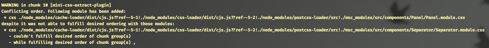

# Conflicting order in mini-css-extract-plugin. Why is it happening and how to fix it correctly?

; https://github.com/webpack-contrib/mini-css-extract-plugin/issues/188

> "With great power there must also come great responsibility" - Peter Parker

Webpack is an extremely popular frontend bundler, which is used by frontend developers all around the world. Why is it so popular? Mainly because of a lot of different plugins and loaders, which makes Webpack such a powerful and customizable tool. One of these plugins is the official [mini-css-extract-plugin](https://github.com/webpack-contrib/mini-css-extract-plugin), which extracts all the stylesheets to separate `.css` files instead of storing them inside `.js` files (which is the default behavior, BTW). This plugin is used by [create-react-app](https://github.com/facebook/create-react-app), so there is a big chance you use it even without knowing it.

A lot of people all around the internet are facing a "Conflicting order" problem with this plugin. After a production Webpack build is finished following warnings appear in the console output:

```
WARNING in chunk 10 [mini-css-extract-plugin]
Conflicting order. Following module has been added:
 * css ./node_modules/cache-loader/dist/cjs.js??ref--5-1!./node_modules/css-loader/dist/cjs.js??ref--5-2!./node_modules/postcss-loader/src!.s/src/components/Button/Button.module.css
despite it was not able to fulfill desired ordering with these modules:
 * css ./node_modules/cache-loader/dist/cjs.js??ref--5-1!./node_modules/css-loader/dist/cjs.js??ref--5-2!./node_modules/postcss-loader/src!./src/components/Typography/Typography.module.css
   - couldn't fulfill desired order of chunk group(s) , 
```



The [original GitHub issue](https://github.com/webpack-contrib/mini-css-extract-plugin/issues/250) has more than 81 comments of people trying to find a solution. But it does not provide you with clear instructions on how to fix the problem, so let's investigate it together and find a solution!

### Disclaimer! Do not ignore this error by using `warningFilter` in Webpack or a special `ignoreOrder` option!

There are tons of comments, which propose to silent those warning (e.g. by using `stats.warningsFilter` Webpack option or by using a special [webpack-filter-warnings-plugin](https://www.npmjs.com/package/webpack-filter-warnings-plugin) or by using an [ignoreOrder](https://github.com/webpack-contrib/mini-css-extract-plugin#ignoreOrder) configuration property). I strongly recommend you **not to do** it, until you investigate the problem first. By filtering out the warnings:

- You will not solve the problem, you will just stop thinking about it. This order conflict can lead to different CSS order between development and production, which leads to style bugs, that will be found only after the site is deployed.
- Even though you've analyzed current problems, and you are sure they will not affect production build, there is always a chance that in the future new order conflicts will appear, which you will not be aware about.

### Why is it happening?

Let's start with the most simplest scenario. We have two pages: `RegistrationPage` and `LoginPage`, which both uses `Typography` and `Button` components.

```typescript
// pages/RegistrationPage/RegistrationPage.tsx

import Button from 'components/Button';
import Typography from 'components/Typography';

// pages/LoginPage/LoginPage.tsx

import Typography from 'components/Typography';
import Button from 'components/Button';
```

As you can see, those components are imported to two different files in a different order. Each of the components has its own CSS file. During the build. those CSS files should be processed and concatenated to one global CSS file. And [mini-css-extract-plugin](https://github.com/webpack-contrib/mini-css-extract-plugin) is not able to determine the order, because it varies between the files. 

In this case the `Button.module.css` and `Typography.module.css` style order is not deterministic and can vary from one build to another, producing different styles on production.

### How to fix?

The easy example is pretty easy to fix: you just analyze the warning and look which two components are affected. Search for all the places around this project where one of these components is used and try to reorder imports, so they will appear in the same order always.

So the example from the previous part should look like this:

```typescript
// pages/RegistrationPage/RegistrationPage.tsx

import Button from 'components/Button';
import Typography from 'components/Typography';

// pages/LoginPage/LoginPage.tsx

import Button from 'components/Button';
import Typography from 'components/Typography';
```

### More complex example

If the things were so easy, we could just use [eslint-plugin-import](https://github.com/benmosher/eslint-plugin-import/) which has a special [order/alphabetize](https://github.com/benmosher/eslint-plugin-import/blob/master/docs/rules/order.md) rule. By enabling this rule and running `eslint` with the `--fix` option, you can easily sort imports alphabetically and you will have a consistent import order all around the project. But does it work for every case? Unfortunately, not. Let's imagine, that our `LoginPage` components does not import the `Button` component, but it imports the `LoginForm` component, which imports the `Button`:

```typescript
// pages/RegistrationPage/RegistrationPage.tsx

import Button from 'components/Button';
import Typography from 'components/Typography';

// pages/LoginPage/LoginPage.tsx

import Typography from 'components/Typography';
import LoginForm from './LoginForm';

// pages/LoginPage/LoginForm/LoginForm.tsx

import Button from 'components/Button';
```

What happened here and why those alphabetically sorted imports emit a warning? Because in `LoginPage` `Button` is imported inside `LoginForm`, so it is imported after `Typography`.

There are two ways to resolve the issue:

1. To import Button after Typography in the `RegistrationPage` component
1. To import `LoginForm` before `Typography` in the `LoginPage` component

There is no automatic way to resolve those issues in the whole project. You need to analyze each of the warnings and to find a solution which will suite best for every use-case around the codebase. Don't be afraid of the warnings count: usually, one fix can eliminate 10 warnings at the same time.

### How to ensure it will never happen again?

So you have analyzed each of the problems, resolved the import order and now the projects compiles without those errors. Nice, it was a difficult journey, and nobody wants to repeat it once again.

But nobody can gurantee that this problem will never happen again in the future. On the contrary, it will happen with a pretty big probability. If it will be found at the same moment, when it appeared, it is extremely easy to fix it. But what if the production build is done on the CI server and nobody is looking at the warnings output?

You can use a special [fail-on-errors-webpack-plugin](https://www.npmjs.com/package/fail-on-errors-webpack-plugin) to make webpack fail if any warnings occured. It can be configured as easy as:

```typescript
// webpack.config.js
const FailOnErrorsPlugin = require('fail-on-errors-webpack-plugin');

module.exports = {
  ...
  plugins: [
    ...
    new FailOnErrorsPlugin({
			failOnErrors: true,
			failOnWarnings: true
		});
  ]
}
```

You can also have `asset size` and `entrypoint size` warnings, which can be configured by using a [perfomance webpack configuration property](https://webpack.js.org/configuration/performance/):

```typescript
// webpack.config.js
module.exports = {
	performance: {
		maxEntrypointSize: 5 * 1024 * 1024,
		maxAssetSize: 1 * 1024 * 1024
	},
}
```

If you have other warnings, which you want to skip, you can always use [stats.warningsFilter](https://webpack.js.org/configuration/stats/#statswarningsfilter)