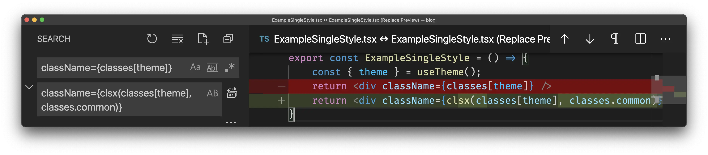
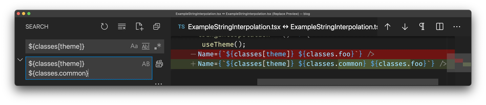
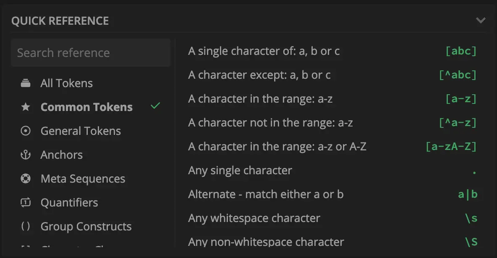
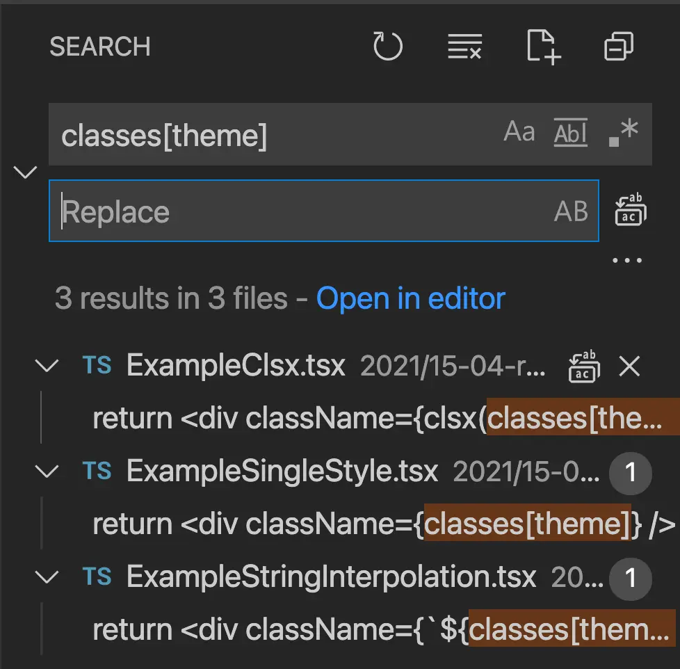
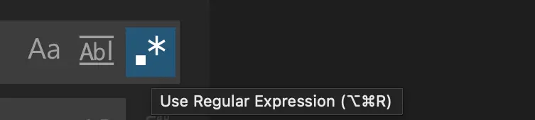
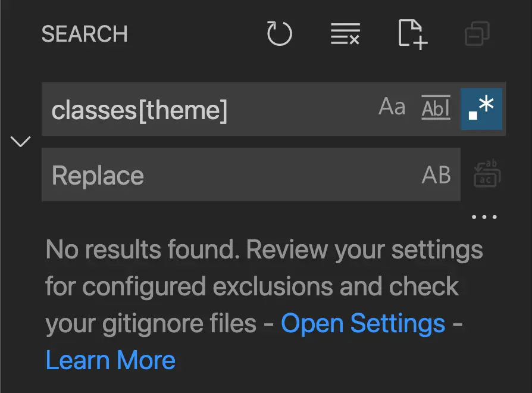
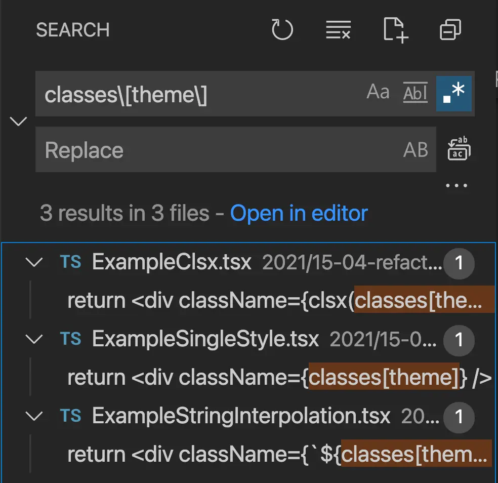
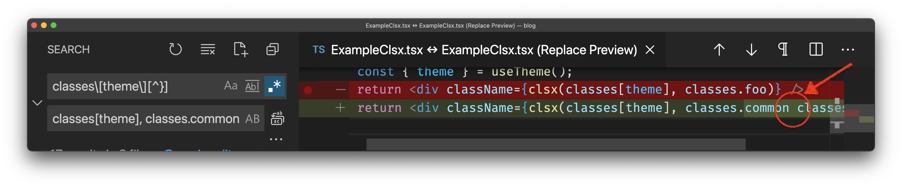
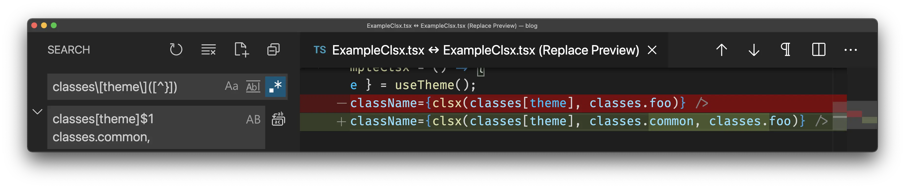

# Refactoring large projects with the help of RegExp

*Photo by [Katt Yukawa](https://unsplash.com/photos/K0E6E0a0R3A)*

**Disclaimer:** I know RegExp is difficult and I do not expect you to know it well to make sense of this article.

Let's say you are a frontend developer working in a team maintaining a large project based on ReactJS. At some point the team decides to add some new architectural changes which influence the entire codebase of the project.

For example, developers decide to change the approach to the application theming. And you need to edit a `.tsx` file of every component to add `classes.common` to every place where `classes[theme]` is applied.

But you have 3 different patterns of this `classes` variable usage project-wise:

| Old code                            | Refactored code                                    |
| ----------------------------------- | -------------------------------------------------- |
| `className={classes[theme]}`        | `className={clsx(classes[theme], classes.common)}` |
| ``className={`${classes[theme]}`}`` | ``className={`${classes[theme]} ${classes.common`}``  |
| `className={clsx(classes[theme])}`  | `className={clsx(classes[theme], classes.common)}` |

One of the ways to solve this problem is to [develop a script which refactors each file of the project one-by-one](/hacks/20210330-refactor-large-codebases-with-nodejs/), but that's too expensive. The team should find an easier way to implement the ticket, or they should *skip it*.

> In such situations make sure to investigate that the goal can be achieved by using Find&Replace in your favorite IDE.

### Easy case (w/o RegExp)

In the easiest scenario you can just replace the code without using any RegExp at all. In case such option is available, always use it!

For example:

**`className={classes[theme]}`** *can be replaced with* `className={clsx(classes[theme], classes.common)}`

**`${classes[theme]}`** *can be replaced with* `${classes[theme]} ${classes.common}`

*It looks like most of the task is already done, but it is too early to make any optimistic estimations until all the patterns are refactored*

### Difficult case (with RegExp)



In case you are not confident enough about your RegExp knowledge, add the following website to your bookmarks: [https://regex101.com/](https://regex101.com/). Also, there are a lot of interactive examples in this article. Feel free to open every example of them to research every unknown character through a glossary in the bottom right corner of **regex101**.



Dealing with `className={clsx(classes[theme])}` is a little bit more confusing...

You can not search for `classes[theme]`, because in this case the ``className={`${classes[theme]} ${classes.common}`}`` will also be included. Those files are already transformed, so you should exclude them.

*This query also includes search results from the files that have already been transformed. You need a way to exclude them.

So, what should you do? One way is to **exclude** all the `classes[theme]`, which are inside the curly brackets (`{}`).

*This small button unleashes all the power you can get for free to do the future refactorings!*



As soon as you enable this mode, you will get 0 results. Whyyyy? 

The `[` and `]` symbols are the **special** ones in RegExp, so the `classes[tm]` can be understood **as `classes` followed by or one `t` char or one `m` char**. So, both `classest` or `classesm` will match, but not `classes[theme]`. *[Read more](https://www.regular-expressions.info/charclass.html)*



> [Try out the interactive example!](https://regex101.com/r/DzQZ05/1)

> In order to fix the query, you can escape the `[]` chars, so your RegExp becomes **`classes\[theme\]`**.

> [Here is the fixed example](https://regex101.com/r/ykhQiX/1)

### Excluding unnecessary results

*Ok, but we are still on the same page... How to exclude the second two results?*

RegExp has a `not a symbol` query, which is `[^]`. For example, you can use `[^a]` to match any symbol which is not `a`. Or you can use `[^ab]` to match any character which is neither `a`, nor `b`. *[Read more](https://www.regular-expressions.info/charclass.html)* (look for "Negated Character Classes" section)



You can skip character screening inside a `[]` block (if it is not `[]`), so `[^\}]` is absolutely identical to `[^}]`. This rule can also be enforced project-wise by using a special [eslint plugin](https://eslint.org/docs/rules/no-useless-escape).



Oooooook, now the RegExp query you are working on can be improved to **`classes\[theme\][^}]`**. This RegExp is used to find any `classes[theme]` which are not followed by the `}` sign. Nice. [Here is the interactive example](https://regex101.com/r/bkeutw/1). On condition that you use this RegExp to do the job, you have a new problem: an extra character is replaced.

*Pay attention to this substitution: the `,` char is lost as it is a part of the RegExp query*

### Matching group comes to rescue



We can use a matching group (anything inside a `()` block) to select any part of the query and to reference it inside the "Replace to" input as a variable. *[Read more](https://docs.microsoft.com/en-us/visualstudio/ide/using-regular-expressions-in-visual-studio?view=vs-2019#capture-groups-and-replacement-patterns)*.

For example, you have the following code: `option="primary"` and you want to change it to `variant="primary"` project-wise. The `option="(.+)"` RegExp can be used to create a matching group of everything inside the round brackets. This way you can reference the first matching group as `$1`. It means that the "Replace to" block should have `variant="$1"`. [Try it out!](https://regex101.com/r/mw5zMV/1)



A matching group is handy to mark any amount of characters in a variable. So, you need to create a matching group for the last character, which is not a `}` char. 

*Photo by [Lasse Møller](https://unsplash.com/photos/6v4TMhQxVJg)*

Ok, here comes the correct answer! Drum roll... Here is the final RegExp: `classes\[theme\]([^}])`. And the final "Replace to": `classes[theme]$1 classes.common,`.

*Looks complicated, but you can open [this query](https://regex101.com/r/Yr5IZa/1) on RegExp101 and review what's going on here!*

### The refactoring king!

Congratulations! It was an insightful journey. And finally you are ready to refactor any project. 



Always commit everything to the working tree before executing those Find&Replace commands. In case of any issue, do not hesitate to use `git reset --hard` or `git checkout -- pathToFolder` to reset the changes.



Here is the final table of the replacements you need to do in order to refactor the project:

| Original Code                       | Find                              | Replace                                            | Transformed Code                                      |
| ----------------------------------- | --------------------------------- | -------------------------------------------------- | ----------------------------------------------------- |
| `className={classes[theme]}`        | `className={classes[theme]}`      | `className={clsx(classes[theme], classes.common)}` | `className={clsx(classes[theme], classes.common)}`    |
| ``className={`${classes[theme]}`}`` | `${classes[theme]}`               | ``${classes[theme]} ${classes.common}``            | ``className={`${classes[theme]} ${classes.common}`}`` |
| `className={clsx(classes[theme])}`  | `classes\[theme\]([^}])` (RegExp) | `classes[theme]$1 classes.common,`                 | `className={clsx(classes[theme], classes.common)}`    |

