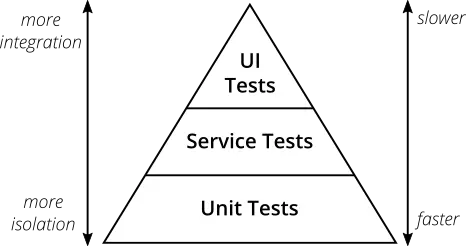
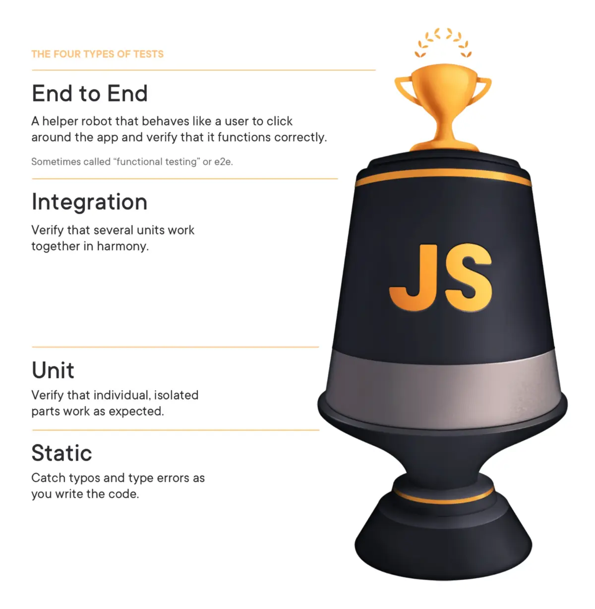
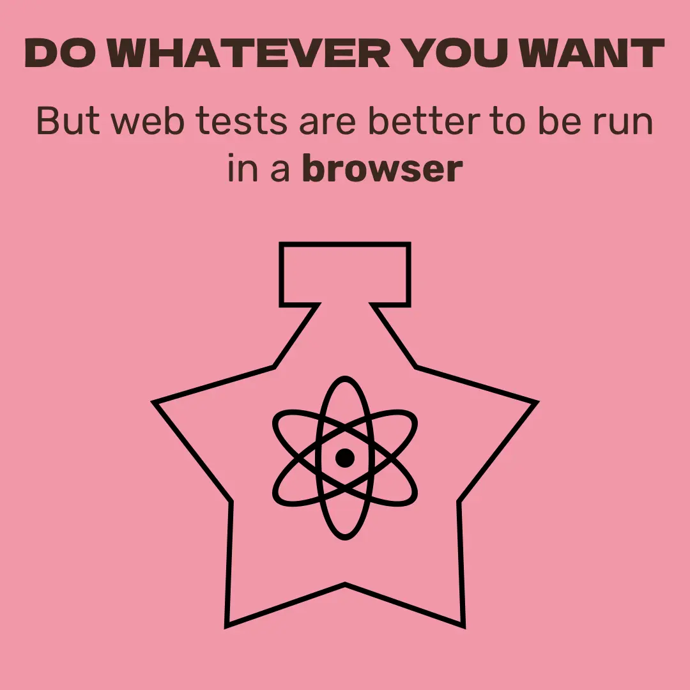
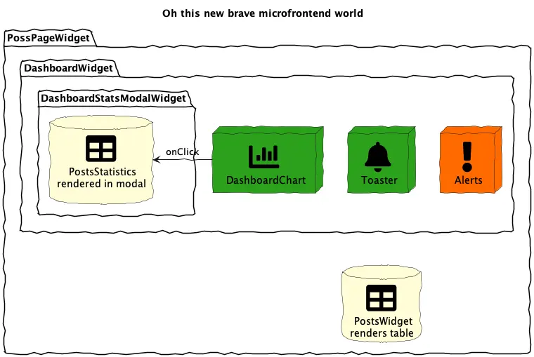
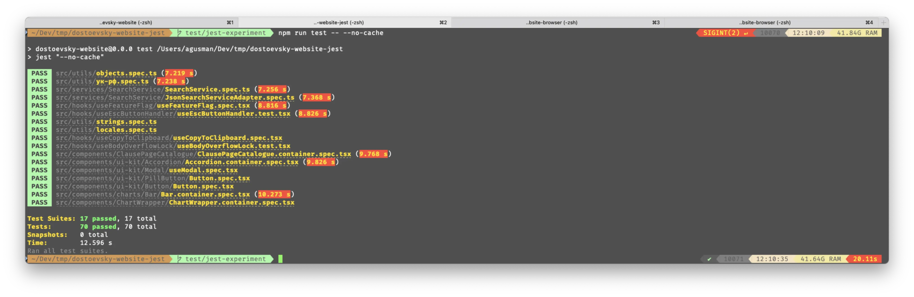
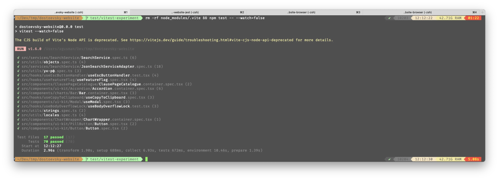
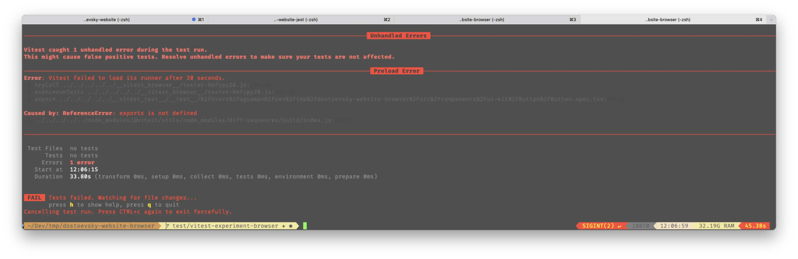
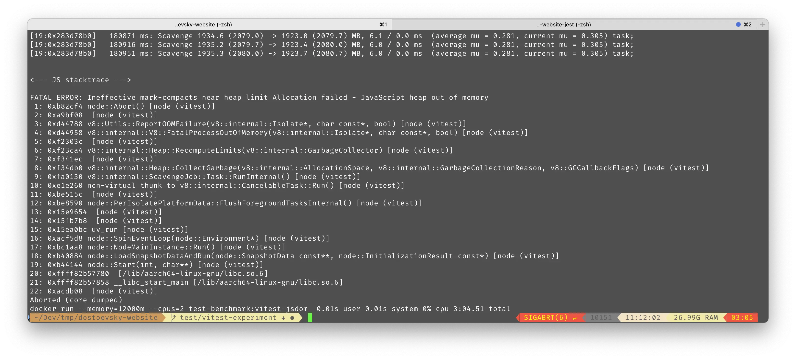

_tl;dr_

In this read, you're going to unlock some critical insights:

- Why opting for end-to-end tests and integration tests that use a real browser can be a game-changer.
- The performance trade-offs you might face when swapping from `jsdom` to authentic browser rendering for your integration tests.

Get ready to deepen your understanding and perhaps, inspire a shift in how you approach web testing!

----


 _testing lab scientists, cloned 1930s era comic strip contemporary pop art collage --v 6.0 --ar 16:9 --no hands_

Once upon a time, in the tech realms, there was a concept named the test pyramid, a concept proposed by none other than [Martin Fowler](https://martinfowler.com/articles/practical-test-pyramid.html) around 2003. This framework strongly advocated for a base heavy with unit tests.



Now, don't get me wrong—I've got mad respect for Martin and his brainchildren (like [SemanticDiff](https://martinfowler.com/bliki/SemanticDiff.html)), but as time marches on, ideas evolve to keep pace with new generations of developers and technologies.

Enter stage left: Kent C. Dodds and his [Testing Trophy](https://kentcdodds.com/blog/the-testing-trophy-and-testing-classifications).



Kent brought a new mantra to the testing scene: [Write tests. Not too many. Mostly integration.](https://kentcdodds.com/blog/write-tests) 

I instantly clicked with this philosophy and have been an avid promoter of it through workshops, lectures, and hands-on coding sessions. My focus? Teaching devs how to craft stellar integration tests using @testing-library, steering clear of testing the nitty-gritty implementation details. With years of experience across various teams and projects, I've refined my approach to testing. Here's my playful twist on it:

> Write test. Not too many. Mostly end-to-end.

And voilà, my very own **Testing Star** 😂: 




So, what types of tests are out there? Well, the classification can vary depending on who you ask, but generally, automated tests are divided into:

- **Unit Tests:** These are tests for a single unit of code in isolation (like a component or service) with all dependencies mocked.
- **Integration Tests (a.k.a. Service Tests):** These test the same unit but integrated with other units. For example, a component test that doesn’t mock the service but might mock the HTTP level.
- **End-to-End Tests (a.k.a. Automation Tests):** These involve running the software in a real environment, such as a browser for frontend applications.

The boundaries between these types aren't always clear-cut. For example, I used to consider a test of a single, pure React component as a unit test if it had no dependencies. But then I came across Kent C. Dodds' perspective that any React component test is an integration test since it checks the integration between your code, the React library, and the browser's DOM API. So now, I label all React component tests as integration tests.


### E2E Tests - the only rescue for complex products

At Intuit, we're crafting QuickBooks Online—a beast of a product teeming with features, including various pages, pop-ups, modals, and configuration options. It's complex, to say the least.

To manage this behemoth, we've adopted a micro-frontend architecture. This approach allows each team to maintain its own small repository, focusing on a limited business scope—similar to microservices in the backend world, but for the frontend. This setup allows the different micro-frontends to be assembled based on business needs, creating a dynamic and flexible UI landscape.



In this intricate world of beautifully composed widgets, relying solely on integration tests at the widget level just doesn't cut it.

[The Grug Brained Developer](https://grugbrain.dev) might put it simply:

> grug says my widget is end of my responsibility, grug makes his widget good
> if other developers break grug's work, is not grug's problem

But the reality we face is quite different. We're responsible for the functionality as a whole, not just our narrowly defined slice of the project. Changes made by maintainers of a parent widget, forgotten API updates, or other unforeseen side-effects can break your seemingly isolated piece. Remember:

> In a complex software composed of many small pieces, the integration amongst all those pieces is what truly provides the confidence needed for a safe release.


### But What If You're Not Dealing with a Complex Product?

You might be working in a medium-sized company, or maybe in a large one but with a smaller, more manageable product. Perhaps it's that sweet spot where you have a monolithic frontend app paired with a few backend systems. This is the kind of setup where everything feels under control, and you can potentially test everything using `@testing-library` right at the project level.

Sure, if that's your scene, you might think the previous segment on complex micro-frontend architectures isn't directly applicable to you.

But even in my smaller pet projects, I've consistently bumped into some challenges when using `@testing-library` for integration tests:

##### The Limitations of jsdom

[jsdom](https://github.com/jsdom/jsdom) is a fantastic tool—kudos to the devs for emulating a browser environment in pure Node.js! But let's face it: jsdom isn't a real browser. This fact can trip up developers who are new to `@testing-library`, especially when they try to test browser-specific functionalities.

Here's a quick list of APIs that aren't implemented in jsdom:
- `window.scrollTo`
- `window.requestAnimationFrame`
- `window.localStorage`
- `window.navigator.clipboard`
- `window.location`
- iframe rendering

Yes, we can mock these, but I've seen junior and mid-level developers struggle with this. They don't want to get bogged down in the nitty-gritty details of how Jest sets up jsdom in a Node.js environment, which typically lacks a `window` object. They just want to write their tests, run them, and move on. Running into these limitations can be a significant motivation killer, shaking their faith in the testing process and its learning curve.

Here’s how easy it used to be to mock these in earlier versions of jsdom:

```typescript
navigator.clipboard = jest.fn();
```

But more recent updates have shifted towards mimicking real browser behavior more closely, which introduced syntax that, while familiar to experts, might seem arcane to newbies:

```typescript
Object.defineProperty(navigator, 'clipboard', {
  value: {
    writeText: () => Promise.resolve(),
  },
});
```

The bottom line? These hurdles are definitely surmountable—I’ve been tackling them for over four years. However, they often crop up unexpectedly, creating unnecessary frustration for new developers.


##### Not All Third-Party Libraries Are Test-Friendly

I’m a big fan of [using as few mocks as possible in integration tests](https://kentcdodds.com/blog/the-merits-of-mocking). The philosophy is straightforward: the more you mock, the less confidence you have in your tests because they become less reflective of real-world usage.

Ideally, you'd only mock the HTTP layer with tools like [msw](https://mswjs.io). Got a third-party library making network requests? Mock the requests, not the entire library. It’s the best way to ensure confidence in the integration between your project and the library.

However, reality often falls short of this ideal. Some third-party libraries still feel like relics from 2004:

```jsx
<script
src={`https://www.paypal.com/sdk/js?client-id=${clientId}&components=buttons,funding-eligibility&enable-funding=venmo`}
/>
```

Then, this SDK should be accessed as `window.paypal.Buttons()` which renders UI inside an `iframe`! 

So, how should we test integration of PayPal SDK to our components by using `@testing-library`? Suppose our component has custom functionality, like an event listener that disables the PayPal button if the weather on Mars is windy. How we should check it? Of course we could mock the PayPal API and check how these spies are called.

But such a test:
1. Is tricky to write and maintain, especially for novices.
2. Doesn't instill much confidence, especially if the PayPal SDK gets updated.


##### The Sneaky Bugs of Environment Changes

Picture this: you're at a startup, and one fine day, the manager bursts in with news. After much analysis, the big brains have decided to roll out a 40% discount for customers, aiming to boost revenue by the fiscal year-end and stave off bankruptcy. You spring into action, crafting a special banner in the footer and validating it with an integration test:

```typescript
expect(screen.getByText('Special 40% discount until Aug 2024!')).toBeVisible();
```

But wait—the plot thickens! The next day, the manager discovers another part of the world called the "Old World" with a peculiar regulation named GDPR. Time to hustle! You quickly integrate a script for that pesky cookie consent banner:

```html
<script src="https://cookie-banner.com/gdpr.js" />
```

And just like that, you deploy.


*Interestingly, this cookie banner screenshot comes from a service that charges you to remove such banners—oh, the irony!*

But what about your promotion banner? Your integration test still gives you the green light, but in reality, the banner is now lurking sheepishly beneath the cookie banner. Sure, a tech-savvy user might close it or even slice it away with tools like [I Don't Care About Cookies](https://www.i-dont-care-about-cookies.eu) (tip: it works with Safari using their AdBlock filter + AdGuard from the App Store). But let’s face it—not everyone is that informed. Most regular folks might leave it open, baffled by this odd UI, avoiding any interaction with it.

So in this specific case your integration test is false positive, it passes, nevertheless the banner is not visible to a portion of users.

### Let's Opt for the Real Deal: Testing in a Real Browser

Ever heard the old adage, "jSdOm iS FaStEr tHaN OpEnInG A ReAl bRoWsEr"? Well, it's time we reconsider.

<blockquote class="twitter-tweet"><p lang="en" dir="ltr">jSdOm iS FaStEr tHaN OpEnInG A ReAl bRoWsEr<br><br>(from: <a href="https://t.co/mouUpzn0a5">https://t.co/mouUpzn0a5</a>) <a href="https://t.co/HD6XD0awnX">pic.twitter.com/HD6XD0awnX</a></p>&mdash; Robert (@robdel12) <a href="https://twitter.com/robdel12/status/1178707491317862400?ref_src=twsrc%5Etfw">September 30, 2019</a></blockquote> <script async src="https://platform.twitter.com/widgets.js" charset="utf-8"></script>

Sure, back in the day, running tests with Selenium felt like a slow crawl. But times, they are a-changin'.

##### Embrace End-to-End Tests with Modern Tools

E2E tests used to be the slowpokes of the testing world, plagued by cumbersome tools like Selenium and Cypress which were slow and flaky.

But hold on, have you checked out Playwright yet? If not, you're missing out. Let me paint a picture: Our team had around 400 individual tests in Cypress, distributed across three Cypress workers. It was running in 30-40 minutes on our CI server.

We've just transitioned to Playwright...

Now, picture this: the same stack of tests on the same CI now zips through in 20 minutes across four different browsers (Chrome, Firefox, Chrome again, and Mobile Safari, aka Webkit) in 35 parallel workers. That's four times the test amount in half the time!


_Trust me, our tests aren't just simple clicks and form submissions—they're complex scenarios requiring a hefty setup during bootstrapping._

If we dial it down to just two browsers (Chrome and Mobile Chrome), the entire suite wraps up in a mere 10 minutes.

And let me tell you, the development experience has been transformed. We're talking smoother, faster, with a much shorter feedback loop.

##### Playwright Component Tests: A Fresh Take on Integration Tests

I've dabbled quite a bit with [Playwright component tests](https://playwright.dev/docs/test-components) and, let me tell ya, the experience is a mixed bag of nuts. When stacked against good ol' `jsdom` integration tests, Playwright is usually about 30-40% slower. However, for certain specific scenarios, it actually matched or even outpaced `jsdom`. Now, 30-40% might sound steep, but when you roll out the entire test suite, the difference in speed barely registers.

The real kicker? If you've already got a suite of integration tests, pivoting to Playwright isn't a walk in the park. [The migration](https://playwright.dev/docs/testing-library) is tricky and, bummer alert, it's not something you can automate.

So, here's the scoop: Playwright component tests are a solid pick for new projects, but for the existing ones, it's like trying to teach an old dog new tricks—doable, but challenging.

##### Experimenting with Vitest Browser Mode for Integration Tests

Recently, I stumbled across a new way to run integration tests in your browser: [vitest browser mode](https://vitest.dev/guide/browser). Haven't tried it in a real project yet, but hey, why not dive in together?

Let's crank open my old 4-year-old Gatsby React.js pet project, which is chock-full of integration tests using `@testing-library`: [dostoevsky-website](https://github.com/goooseman/dostoevsky-website). The plan? Refactor it to use Vitest and give browser testing a whirl, while clocking the performance.

Before the switch, running 70 tests took about 20 seconds on my machine with the `--no-cache` Jest CLI argument: `npm run test -- --no-cache`, using NodeJS v12.17.0.


Jest, you're taking ages just to get ready...

The leap from Jest to Vitest? Took about 40 minutes. **Keen on trying this migration? Here’s [a handy PR](https://github.com/goooseman/dostoevsky-website/pull/61) detailing all the steps for a typical React/TypeScript project**. Now, let’s fire up the tests and see how the switch affects performance. Vitest doesn’t have a `--no-cache` flag, but I discovered the cache is stashed at `node_modules/.vitest`. So, the new command is: `rm -rf node_modules/.vite && npm test -- --watch=false`


If you haven’t switched to `vitest`, consider this your nudge. Migrating from `jest` is a breeze.

Pretty slick, right? Just by switching test runners, the tests already speed up. I suspect turning on [browser mode](https://vitest.dev/guide/browser) might slow things down again, but fingers crossed they won’t lag beyond the original Jest times. Shall we give it a shot?

[Here’s the PR to kick off browser testing](https://github.com/goooseman/dostoevsky-website/pull/62)

And I run it the same way as before: `rm -rf node_modules/.vite && npm test -- --watch=false`

Turns out, it’s not as straightforward as I hoped. The tests just wouldn’t run. Turns out the feature's still experimental. There’s a related [GitHub issue](https://github.com/vitest-dev/vitest/issues/3124#issuecomment-1539389830) discussing a stuck network request, but in my case, it’s a barrage of network requests, even when running a single test file: `rm -rf node_modules/.vite && npm test -- src/components/ui-kit/Button/Button.spec.tsx`:

_The browser seems busy..._

_But alas, the reporter throws in the towel with a test failure due to `Caused by: ReferenceError: exports is not defined`._

I’ve already sunk more time into this article than planned. While I'm a problem solver and it piques my interest to overcome this hurdle and snag some results, let's pivot:

> If this research intrigues you, drop a comment below, and more motivation will magically appear for me to wrap this up 🤙



**Why Didn't I Use Docker for Benchmarking?**

Ah, Docker! The beloved tool for running apps in containers to guarantee consistency across environments. It seemed like the perfect fit for:
- Ensuring absolute isolation of test runs from any cache files
- Restricting container resources to fend off any performance hiccups caused by other apps on my machine

And yes, that was the initial game plan: whip up a simple `Dockerfile` and launch it with this command: `docker run --memory=12000m --cpus=2 test-benchmark:vitest-jsdom`. But here’s the kicker: `vitest` kept crashing with heap allocation errors, even when I threw ~12GB of RAM at it:


Turns out, I was running Docker on my Mac via Rancher Desktop, which itself spins up a Linux VM with limited resources. Time was tight, and fiddling with it wasn’t an option. So, I went old-school: shut down all other apps on my Mac and ran the benchmarks directly, no Docker in sight.



### Wrapping It Up


_I absolutely adore this quote and firmly believe that recreating user behavior is the key to trustworthy tests._

With that in mind, here’s my two cents:

1. Prioritize writing **mostly** end-to-end tests that mimic user interactions. Skip the API mocks and go for the real deal. The fewer shortcuts you take, the more reliable your tests will be. And hey, performance woes aren't as scary as they used to be.
2. Don’t write off integration tests just yet—they still have their merits, especially when you need to test specific bits of logic in isolation, like form validations for unhappy paths. But maybe, just maybe, consider running those in a real browser.
3. To those of you already knee-deep in testing-library tests: why not take `vitest` for a spin? Drop me a line if you’re curious about wrapping up the [browser mode exploration](https://vitest.dev/guide/browser).
4. Starting fresh on a project? I’d nudge you towards giving [Playwright component tests](https://playwright.dev/docs/test-components) a go. Sure, they're tagged as experimental, but from what I’ve seen, they play nice without any major hitches.

There you have it, my roadmap to a more authentic and reliable testing environment. Dive in and test away!

