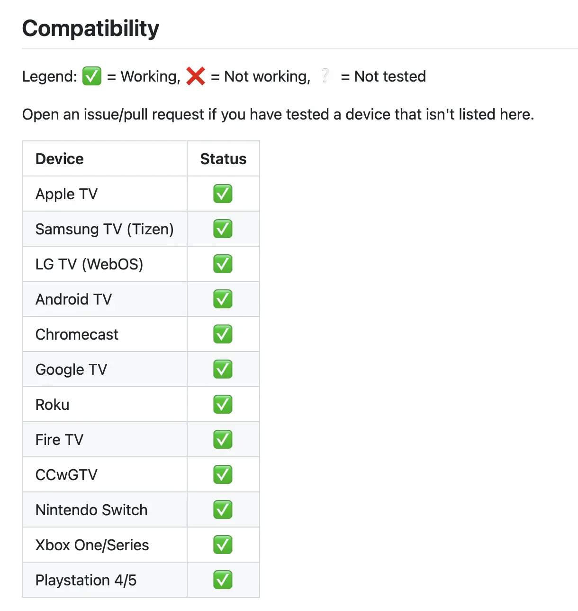
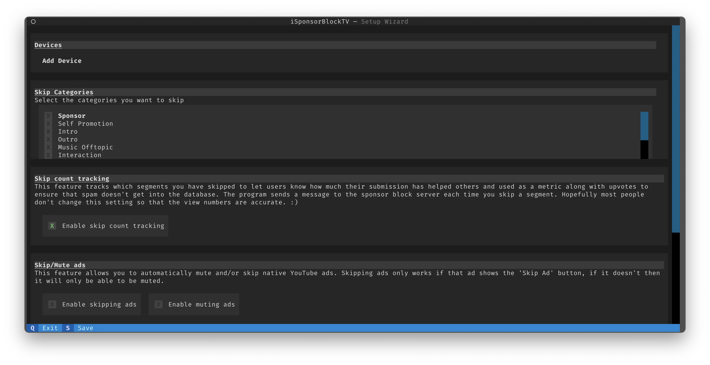

_tl;dr_

*Just a heads up—this isn't a guide on using AdBlock or similar tools. I'm all in for supporting creators; that's why I've got a Youtube Premium subscription. So, no worries, creators still get their well-deserved coin even when ads are skipped.*

*What we're diving into today, though, is cruising through Youtube sans those pesky embedded ads that creators sprinkle throughout their videos.*

*Stick around, and I'll show you how to remove all integrated ads not just on your browser but on your Apple/Google/Smart TV YouTube apps too.* 

-----


_watching tv ad, cloned 1930s era comic strip contemporary pop art collage --v 6.0 --ar 16:9 --no hands_

_Disclaimer: Big shoutout to [vas3k](https://vas3k.blog/notes/sponsorblock/) for the light bulb moment! This piece isn’t a direct translation or rewrite, but rather a creation sparked by his article._

### Part 0. What is SponsorBlock?

Ever stumbled on [SponsorBlock](https://sponsor.ajay.app)? It’s this nifty open-source extension, powered by the collective wisdom of the community that lets you magically skip sponsored segments in any YouTube video.

How does this sorcery work? Well, some other SponsorBlock user marks parts of the video as sponsored, which allows you (and anyone else who prefers to skip the sales pitch) to breeze right past those bits.

Given that it's all community-driven, I was skeptical about how well it would serve on obscure or smaller channels or super fresh content, just dropped 42 minutes ago. Spoiler alert: it's surprisingly effective across the board!


### Part 0 and a half: but what about the moral side of the question?

Alright, let's get real for a minute. I absolutely respect content creators' right to earn a buck from their videos. They deserve it.

However, there are times when the ad integrations can get a little... intense.

_5 sponsored blocks in a video, we have a winner! 🏆_

Or for example, a Russian-speaking blogger I follow who discusses relocating to the US. Each one of his videos consistently features:
- A sponsored ad for life-altering programming/data science/design courses,
- A self-promo for his visa center that assists with various US visas,
- And a plug for his latest investment venture, a hookah bar in LA.

Yes, that's the lineup for virtually every video!

Here’s where SponsorBlock shines—you can tailor it to your taste. Channels like [Donut media](https://www.youtube.com/@Donut) that churn out uniquely creative ads? I don't mind watching those, so they're on my whitelist.

However, for most other channels, I'm comfortable skipping. Here's why:
- Many creators are compensated based on views, not clicks,
- Recycled content: Ads tend to be identical across multiple videos.

### Part 1. Start using it in your browser

Ready to dive in? Head over to the [official website](https://sponsor.ajay.app), smack the icon of your browser, and hit install. Yep, it's that straightforward.

Oh, and a shoutout to my fellow Safari aficionados – we've got a couple of routes to choose from:
- Roll up your sleeves and [build it from source](https://github.com/ajayyy/SponsorBlock/wiki/Safari) for zero cost.
- Or, toss a few bucks [for the App Store version](https://github.com/ajayyy/SponsorBlock/wiki/Safari), which helps the developer cover the Apple Developer license fees.

As someone who's all about supporting the underdogs and open-source heroes, I went the paid route. Best few bucks spent!

### Part 2. But how can it possibly work with my Smart TV???

Now, let's get to the juicy bits. Admit it, you probably thought it was impossible to get something like this running on your Apple TV. I sure did. And since I consume about 80% of my YouTube content on the grandeur of my flat screen, without a solution here, we'd be at a dead end.


But, behold the magnificence of the open-source realm! Another developer brewed up [iSponsorBlockTV](https://github.com/dmunozv04/iSponsorBlockTV).
 _WTF is CCwGTW? It appears to be Google's Chromecast!_

Wondering how the heck this could work?


Here's your new project: scout your home for any device capable of running a Docker container that's usually powered on. Some potential candidates include:

- Synology NAS,
- Raspberry PI or any alternative (OrangePi was a star last I checked),
- Microwave with Android and a secured VPN link straight to the Chinese government,
- Your always-on PC or Mac.

I was a die-hard Raspberry Pi enthusiast until I traded being youthful (read: had more free time) to tinker with FPV drone videos and switched to Synology.

Most of my walkthroughs will be on Synology, but the steps should mirror closely on any Docker-friendly system.

Let's start with connecting by SSH, if this device is a remote device: `ssh syn-local`


How does this SSH shorthand work?

SSH uses a configuration defined at `~/.ssh/config`, where you can set up different SSH hosts and designate specific ssh keys for each. For instance, here's a snippet of my own config:

```
Host syn-local
  HostName 192.168.31.124
  Port 22
  IdentityFile ~/.ssh/home
  User goooseman
```

This makes the command `ssh syn-local` effectively equivalent to `ssh goooseman@192.168.31.124 -i ~/.ssh/home`.


Then, I'll create a directory to store persistent configuration and run a special setup wizard:
```sh
mkdir isponsorblocktv
docker run --rm -it \
-v $PWD/isponsorblocktv/:/app/data \
--net=host \
-e TERM=$TERM -e COLORTERM=$COLORTERM \
ghcr.io/dmunozv04/isponsorblocktv \
--setup
```
 _Mmmm, nice hacky UI to configure, respect 🤙_

Navigating through the UI is a breeze with the "tab" and "enter" buttons. You'll need to:
- Add your device (it will prompt you to enter a code found under **Settings -> Pair TV with code**),
- Decide which categories of content you'd like to skip.
 _You may also choose to skip intro/outro_

After configuring, hit save (S) and quit (Q) and kick off the service with:

```sh
docker run -d \
--name iSponsorBlockTV \
--restart=unless-stopped \
-v $PWD/isponsorblocktv:/app/data \
ghcr.io/dmunozv04/isponsorblocktv
```

Voila!

Now, every time I fire up YouTube on my Apple TV, I'm greeted with the "iSponsorBlockTV remote is connected" notification. As I watch videos, it magically skips over sponsored content.

So there you have it, more time saved from skipping ads, and more moments to spend with loved ones. 


The end.
