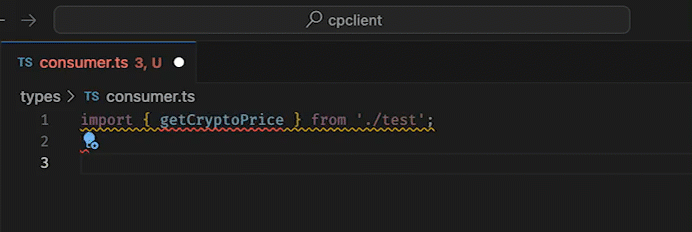
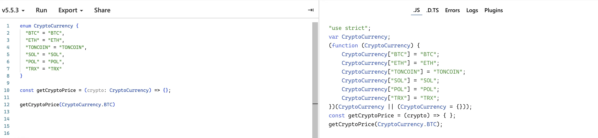
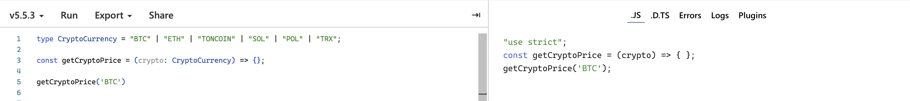
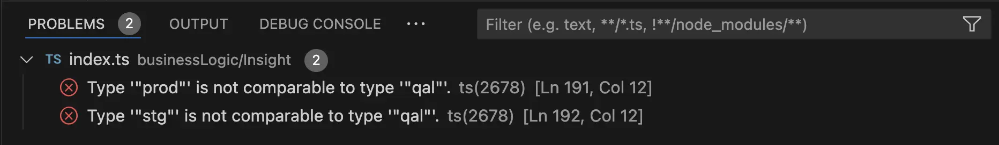

_different spider mans pointing at each other meme, cloned 1930s era comic strip contemporary pop art collage --v 6.0 --ar 16:9_

Today, I've got a quick tip for all you TypeScript fans out there.

> **Stop using enums and start using string literals instead!**

### What did he say about eeee-num?

Yeah, you heard that right! Let's break it down with a simple example. Normally, devs use enums to define a set of allowed string values.

```typescript
// services/crypto.ts
enum CryptoCurrency {
  "BTC" = "BTC",
  "ETH" = "ETH",
  "TONCOIN" = "TONCOIN",
  "SOL" = "SOL",
  "POL" = "POL",
  "TRX" = "TRX"
}

const getCryptoPrice = (crypto: CryptoCurrency) => {
  // logic here
}
```

I'd propose this instead:

```typescript
// services/crypto.ts
type CryptoCurrency = "BTC" | "ETH" | "TONCOIN" | "SOL" | "POL" | "TRX";

const getCryptoPrice = (crypto: CryptoCurrency) => {
  // logic here
}
```

### Reasons Why


#### 🛠️ Development Experience

If a function is used in the same file where it’s defined, your dev experience is smooth sailing. But the moment you call it from another file, you’ve got the additional hassle of importing the enum.

```typescript
import { getCryptoPrice, CryptoCurrency } from 'services/crypto';

...
  getCryptoPrice(CryptoCurrency.BTC);
...
```

And what do we need this extra import for? You might think it’s for autocompletion. Nope, guess again! Autocompletion works just fine with string literals, without any extra imports. Just take a look:


_Works like magic: import a function, and arguments are autocompleted!_

#### ✂️ Okama's Razor

Why use a more complex structure when simpler ones will do just fine?

You might shout, "Enums are simple!" but here’s the thing: Enums are one of the rare TypeScript features that actually get left in the JavaScript output after transpiling.

As stated in the [official docs](https://www.typescriptlang.org/docs/handbook/enums.html#enums-at-runtime):
> Enums are real objects that exist at runtime.

Check it out yourself on this [interactive playground](https://www.typescriptlang.org/play/?#code/KYOwrgtgBAwgTgTwA4BcD2MxzqAxgqAbwCgooAiAIQBUZyoBeCmugGlIoFFqAJep8tz7sy5agHkAcjHEBJSfwoTpchSIoBlcQBlF5LbvXkACjr2nDHMQCUAGnup3yxAL7FiuNCADOKKAHNgFHhkdGM4AEtcYEYoAApcRFQ0AC5YJPRMbDwEAEpGAD4iFwBudxRkGJDkrJwQfA0USJB-WKpaegAfLl4upSkZeT79Myhuk1Hxx3syjy9fAKDqsMjoxubWpgSM1PTQjCw6hqaIlvyGIsJS90DgnfCo4HXT-ziAchY33JKgA).


*Take a look on the right pane which has compiled code*


*Looks nicer, no?*

Sure, the object is small, but why leave it in the code when it can be avoided altogether? We're using TypeScript just for type checking, so let's do it in a way that doesn't add any extra **runtime overhead**!



By the way, if you’re not already familiar with the [TypeScript playground](https://www.typescriptlang.org/play/), I definitely recommend bookmarking it.

There are tons of use cases where you just want to build a minimal reproduction of an issue or check the transpilation output.

And here you can also use the share functionality to send the code snippet to your colleagues.





BTW, I really love how the "Share" link functionality is implemented here: instead of persisting your code snippet in some persistent storage, they just store it in the URL itself.

Take a look at the URL: `https://www.typescriptlang.org/play/?#code/KYOwrgtgBAwgTgTwA4BcD2MxzqAxgqAbwCgooAiAIQBUZyoBeCmugGlIoFFqAJep8tz7sy5agHkAcjHEBJSfwoTpchSIoBlcQBlF5LbvXkACjr2nDHMQCUAGnup3yxAL7FiuNCADOKKAHNgFHhkdGM4AEtcYEYoAApcRFQ0AC5YJPRMbDwEAEpGAD4iFwBudxRkGJDkrJwQfA0USJB-WKpaegAfLl4upSkZeT79Myhuk1Hxx3syjy9fAKDqsMjoxubWpgSM1PTQjCw6hqaIlvyGIsJS90DgnfCo4HXT-ziAchY33JKgA`.

Everything after `#code` is actually your code snippet being encoded with [lz-string](https://github.com/pieroxy/lz-string). Here’s an [article about the specification](https://glinscott.github.io/lz/index.html) and an [interactive playground](https://pieroxy.net/blog/pages/lz-string/index.html) for the curious ones.



#### 🔥 Inline Definition

String literal types can be defined directly in the function signature, which is super convenient for small functions.

```typescript
const getUsPartySlogan = (party: "republicans" | "democrats") => {};
```

### And What About Refactoring?


Enum proponents might argue that using enums is better for future refactorings. If a value changes, you can simply use the "Find Reference" feature in your IDE to locate all enum usage across the project and update them.

But having experience in refactoring large, enterprise-level legacy codebases, I can tell you that the same goes for string literals. Just update the string literal to a new value and use the "Problems" tab in the IDE to find all typing errors throughout the project and fix them accordingly.



### So, No Use-Cases for Enums at All?

I’ll give you this: There are scenarios where enums might still be preferred over string literals. These cases usually involve the need for descriptive names for values. A solid example is a `STATUS_CODES` enum:

```typescript
enum STATUS_CODES {
  "SUCCESS" = 200,
  "CREATED" = 201,
  "ACCEPTED" = 202,
  ...
  "NOT_FOUND" = 404,
  ...
}
```

Here, the status code integers need to be used in the code, but their human-readable names enhance development experience. In cases like this, the improved DX is worth the additional runtime overhead and the need to import something at the consumer level.

### UPD1: about enumeration

As reddit user [winky9827](https://www.reddit.com/user/winky9827/) correctly [noted](https://www.reddit.com/r/typescript/comments/1e3yyaj/comment/ldb98uv/?utm_source=share&utm_medium=web3x&utm_name=web3xcss&utm_term=1&utm_content=share_button):

> The problem with string literal types is that they cannot be enumerated easily. I much prefer this instead:

```typescript
const usPoliticalParties = ['Democrat','Republican'] as const
export type UsPoliticalParties = typeof usPoliticalParties[number];
```

> Best of both worlds.

Can not disagree with him: if enumeration is needed, this may be a good trade-off. But I would use it only for the cases when enumeration is really needed, because from my experience such syntax is hard to be understood by TS newcomers.

### UPD2: use `${enum}`

As reddit user [AdventurousDeer577/](https://www.reddit.com/user/AdventurousDeer577/) [added](https://www.reddit.com/r/react/comments/1e3yzkp/comment/ldbdzkn/?utm_source=share&utm_medium=web3x&utm_name=web3xcss&utm_term=1&utm_content=share_button)

> `${Enum}` removes the need for importing the type. It will work just as it would for a string literal.
> Also string literals are not iterable, but enums are. You can use Object.values(Enum) (or keys, or entries, ...).
> Different use cases, different implementations - one does not replace the other


And indeed it looks like a good solution, combined together with a comment from **  
Álvaro** under this post to use `const enum` to avoid any overhead it looks like the best solution:

```typescript
// services/crypto.ts
const enum CryptoCurrency {
  "BTC" = "BTC",
  "ETH" = "ETH",
  "TONCOIN" = "TONCOIN",
  "SOL" = "SOL",
  "POL" = "POL",
  "TRX" = "TRX"
}

const getCryptoPrice = (crypto: `${CryptoCurrency}`) => {
  // logic here
}

getCryptoPrice('BTC');
```

[Playground link](https://www.typescriptlang.org/play/?#code/PTAEGcFMCcDcEsDGlzEdAngBwC4HsA6HcAKETwDtwdRIKBXAW1AGFNc8X7po7ENQAbxKhQAIgBCAFRZjQAXnHTZAGhHiAolIAScxWK261osVIDyAORZmAkhb3jzV2-ePiAymYAyDsZ59uYgAK3r4hAeqmAEoAGr5SsWIkAL4kZJTUoADmkDhs2PhB0EiQCqAAFOgFeABcoAAGACSC+RxcPHwYyfUAlAoAfELqIKAANnhZSKAAFjCQKWk5eeyFxcjlAOTKGz0A3EA)